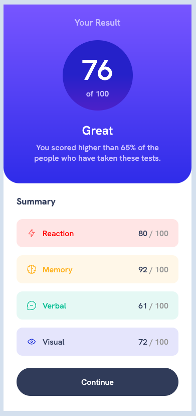

# Frontend Mentor - Results summary component solution

This is a solution to the [Results summary component challenge on Frontend Mentor](https://www.frontendmentor.io/challenges/results-summary-component-CE_K6s0maV). Frontend Mentor challenges help you improve your coding skills by building realistic projects.

## Table of contents

- [Overview](#overview)
  - [Screenshot](#screenshot)
- [My process](#my-process)
  - [Built with](#built-with)
  - [What I learned](#what-i-learned)

## Overview

### Screenshot

## My process

### Built with

- Semantic HTML5 markup
- Flexbox
- Grid
- Mobile-first workflow

### What I learned

#### BEM (Block Element Modifiers) CSS Naming Convention
First attemp at using this CSS naming convention